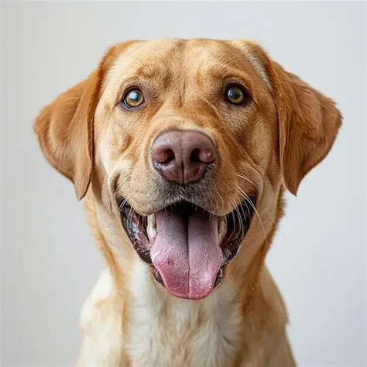

# Encabezado de nivel 1

## Encabezado de nivel 2

### Encabezado de nivel 3

###### Encabezado de nivel 6

<h1>Encabezado de nivel 1 en HTML</h1>

Otro encabezado de nivel 1
==========================

Otro encabezado de nivel 2
--------------------------

***

Este es mi primer párrafo.\
Este es mi segundo párrafo.

***

**Texto en negrita**

__Texto en negrita__

***

*Texto en itálica*

_Otro texto en itálica_

***

***Texto en negrita y en itálica***

___Texto en negrita y en iálica___

***

~~Texto tachado~~

***

E = mc^23456^

E = mc~23456~

***

> *En un lugar de La Mancha*  
> *de cuyo nombre no quiero acordarme*  
>...

***

[Sitio web de la universidad de Costa Rica](https://ucr.ac.cr)

[Youtube](https://youtube.com)

***

***

Imagenes remotas

***

Imagenes locales

***

Imagen con tamaño modificado

